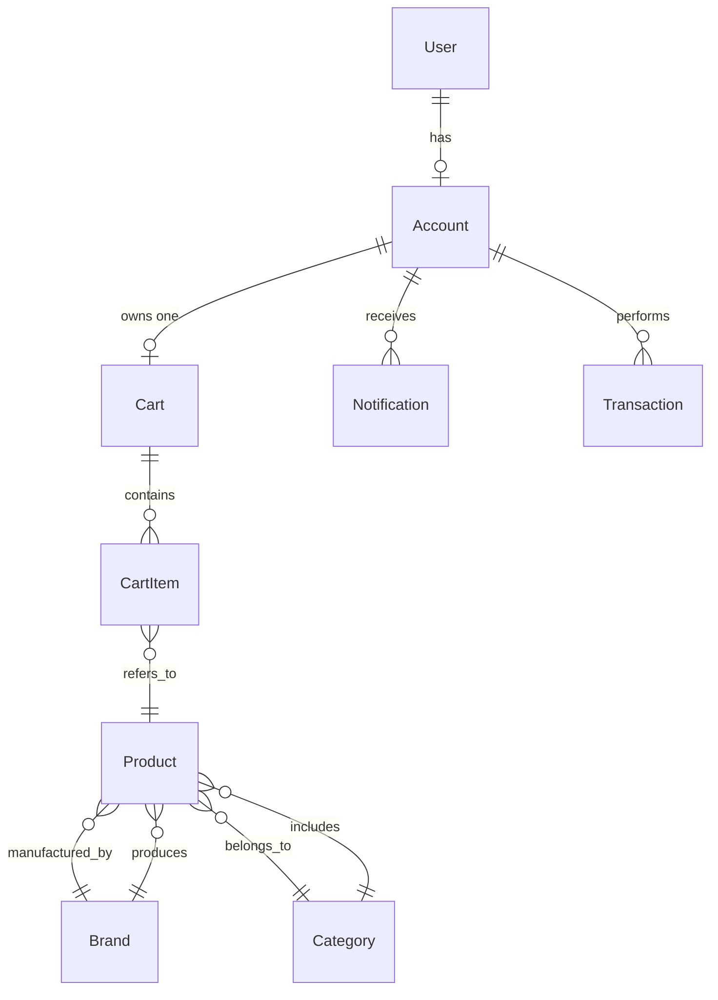

# 🦭SealMarket API

## О проекте
**SealMarket** — это REST API для интернет-магазина мужской одежды и обуви, построенный на ASP.NET Core с применением Clean Architecture и современных практик разработки. Проект демонстрирует полный цикл разработки enterprise-приложения: от проектирования доменной модели и реализации бизнес-логики до настройки аутентификации, пагинации, фильтрации и структурированного логирования. API предоставляет все необходимые эндпоинты для управления товарами, пользователями, корзинами, уведомлениями и транзакциями, следуя принципам RESTful дизайна.

## Технологический стек
- **.NET 8.0** (ASP.NET Core Web API)
- **MySQL** с Entity Framework Core 8
- **JWT Bearer Authentication**
- **Repository Pattern**
- **Serilog** для структурированного логирования
- **Swagger/OpenAPI** для автоматической документации

## Архитектура
Проект реализован с использованием Clean Architecture, что обеспечивает высокую поддерживаемость и тестируемость:

## Диаграмма связей сущностей

## Доменные сущности
### User
| Свойство | Тип | Описание |
|----------|-----|----------|
| `Id` | `int` | PK, Auto Increment |
| `Name` | `string` | Имя |
| `BirthDate` | `DateOnly` | Дата рождения |
| `City` | `string` | Город проживания |
| `AvatarUrl` | `string` | URL аватарки |
| `Account` | `Account` | Навигация → Account (1:1) |

### Account  
| Свойство | Тип | Описание |
|----------|-----|----------|
| `Id` | `int` | PK |
| `UserId` | `int` | FK → User.Id |
| `Login` | `string` | Уникальный логин |
| `Password` | `string` | Хэш пароля (BCrypt) |
| `Email` | `string` | Уникальный email |
| `PhoneNumber` | `string` | Номер телефона |
| `Balance` | `decimal` | Баланс (default: 0) |
| `Role` | `string` | "User" или "Admin" |
| `CreatedAt` | `DateTime` | Дата создания |
| `Cart` | `Cart` | Навигация → Cart (1:1) |
| `Transactions` | `List<Transaction>` | Навигация → Transaction (1:N) |
| `Notifications` | `List<Notification>` | Навигация → Notification (1:N) |

### Cart
| Свойство | Тип | Описание |
|----------|-----|----------|
| `Id` | `int` | PK |
| `AccountId` | `int` | FK → Account.Id |
| `Name` | `string` | Название (default: "MyCart") |
| `CartItems` | `List<CartItem>` | Навигация → CartItem (1:N) |

### CartItem
| Свойство | Тип | Описание |
|----------|-----|----------|
| `Id` | `int` | PK |
| `ProductId` | `int` | FK → Product.Id |
| `CartId` | `int` | FK → Cart.Id |
| `Quantity` | `int` | Количество (min: 1) |
| `AddedAt` | `DateTime` | Дата добавления |
| `Product` | `Product` | Навигация → Product (N:1) |
| `Cart` | `Cart` | Навигация → Cart (N:1) |

### Product
| Свойство | Тип | Описание |
|----------|-----|----------|
| `Id` | `int` | PK |
| `Name` | `string` | Название товара |
| `BrandId` | `int` | FK → Brand.Id |
| `CategoryId` | `int` | FK → Category.Id |
| `Description` | `string` | Описание товара |
| `ImageUrl` | `string` | URL изображения |
| `Quantity` | `int` | Кол-во на складе (≥0) |
| `Price` | `decimal` | Цена (>0) |
| `IsActive` | `bool` | Активен ли (soft delete) |
| `CreatedAt` | `DateTime` | Дата добавления |
| `Brand` | `Brand` | Навигация → Brand (N:1) |
| `Category` | `Category` | Навигация → Category (N:1) |

### Brand
| Свойство | Тип | Описание |
|----------|-----|----------|
| `Id` | `int` | PK |
| `Name` | `string` | Уникальное название |
| `LogoUrl` | `string` | URL логотипа |
| `Description` | `string` | Описание бренда |
| `Products` | `List<Product>` | Навигация → Product (1:N) |

### Category
| Свойство | Тип | Описание |
|----------|-----|----------|
| `Id` | `int` | PK |
| `Name` | `string` | Уникальное название |
| `Description` | `string` | Описание категории |
| `ImageUrl` | `string` | URL изображения |
| `Products` | `List<Product>` | Навигация → Product (1:N) |

### Transaction
| Свойство | Тип | Описание |
|----------|-----|----------|
| `Id` | `int` | PK |
| `AccountId` | `int` | FK → Account.Id |
| `TotalSum` | `decimal` | Сумма операции (>0) |
| `IsSuccessful` | `bool` | Успешно ли выполнена |
| `Message` | `string` | Сообщение/причина |
| `CreatedAt` | `DateTime` | Дата операции |
| `Account` | `Account` | Навигация → Account (N:1) |

### Notification
| Свойство | Тип | Описание |
|----------|-----|----------|
| `Id` | `int` | PK |
| `AccountId` | `int` | FK → Account.Id |
| `Name` | `string` | Заголовок уведомления |
| `Message` | `string` | Текст уведомления |
| `DateTime` | `DateTime` | Дата отправки |
| `HasBeenRead` | `bool` | Прочитано ли (default: false) |
| `Account` | `Account` | Навигация → Account (N:1) |

## API Endpoints

### Аутентификация (/api/auth)
| Метод | Endpoint | Описание | Роли | Request DTO | Response DTO |
|-------|----------|----------|------|-------------|--------------|
| POST | `/api/auth/register` | Регистрация | - | RegisterDto • UserName • BirthDate • City • Login • Email • Password • PhoneNumber | AuthResultDto • Token • AccountId • Email • FullName • Role |
| POST | `/api/auth/login` | Вход | - | LoginDto • Login • Password | AuthResultDto • Token • AccountId • Email • FullName • Role |

### Пользователи (/api/users)
| Метод | Endpoint | Описание | Роли | Request DTO | Response DTO |
|-------|----------|----------|------|-------------|--------------|
| GET | `/api/users` | Список пользователей | - | UsersFilterDto • Page • Size • SearchText • OrderBy | List\<ShortUserDto\> • Id • Name |
| GET | `/api/users/my-profile` | Мой профиль | Customer | - | UserProfileDto • Id • Name • BirthDate • City • AccountId • Login • Email • PhoneNumber • Balance • RegisteredAt • AvatarUrl |
| GET | `/api/users/{id}` | Публичный профиль | - | - | PublicUserDto • Id • Name • BirthDate • City • AvatarUrl |
| PUT | `/api/users/my-profile` | Обновить профиль | Customer | UpdateUserDto • UserName? • City? • AvatarUrl? | - |
| DELETE | `/api/users/{id}` | Удалить пользователя | Admin | - | - |
| DELETE | `/api/users/my-account` | Удалить свой аккаунт | Customer | - | - |

### Аккаунты (/api/accounts)
| Метод | Endpoint | Описание | Роли | Request DTO | Response DTO |
|-------|----------|----------|------|-------------|--------------|
| GET | `/api/accounts` | Все аккаунты | Admin | AccountsFilterDto • Page • Size • Role • MinBalance | List\<ShortAccountDto\> • Id • Login • UserId |
| GET | `/api/accounts/my-account` | Мой аккаунт | Customer | - | AccountDashboardDto • Id • Balance • CreatedAt • CartId • CartItemsQuantity • NoReadNotificationsQuantity |
| GET | `/api/accounts/{id}` | Аккаунт по ID | Admin | - | AccountDashboardDto • Id • Balance • CreatedAt • CartId • CartItemsQuantity • NoReadNotificationsQuantity |
| PUT | `/api/accounts/my-account` | Обновить аккаунт | Customer | UpdateAccountDto • Login? • Email? • PhoneNumber? | - |

### Товары (/api/products)
| Метод | Endpoint | Описание | Роли | Request DTO | Response DTO |
|-------|----------|----------|------|-------------|--------------|
| GET | `/api/products` | Список товаров | - | ProductsFilterDto • Page • Size • MinPrice • MaxPrice • SearchText • CategoryName | List\<ShortProductDto\> • Id • Name • ImageUrl • Price • BrandId • CategoryId |
| GET | `/api/products/{id}` | Товар по ID | - | - | ProductDto • Id • Name • Description • ImageUrl • Quantity • Price • CreatedAt • IsActive • BrandId • BrandName • CategoryId • CategoryName |
| POST | `/api/products` | Создать товар | Admin | CreateProductDto • Name • BrandId • CategoryId • Description • ImageUrl • Quantity • Price • IsActive | ProductDto |
| PUT | `/api/products/{id}` | Обновить товар | Admin | UpdateProductDto • Name? • Description? • ImageUrl? • Quantity? • Price? • IsActive? | - |
| DELETE | `/api/products/{id}` | Удалить товар | Admin | - | - |

### Корзина (/api/carts)
| Метод | Endpoint | Описание | Роли | Request DTO | Response DTO |
|-------|----------|----------|------|-------------|--------------|
| GET | `/api/carts/my-cart` | Моя корзина | Customer | - | CartDto • Id • Name • TotalPrice • CartItems |
| GET | `/api/carts/{id}` | Корзина по ID | Admin | - | CartDto |
| GET | `/api/carts` | Все корзины | Admin | CartsFilterDto • Page • Size • MinTotalPrice • MaxTotalPrice | List\<ShortCartDto\> • Id • AccountId |
| POST | `/api/carts/my-cart/add-item` | Добавить товар | Customer | CreateCartItemDto • ProductId • Quantity | CartItemDto • Id • ProductId • Quantity • AddedAt • ProductName • ProductImageUrl • ProductPrice • TotalPrice |
| DELETE | `/api/carts/my-cart/remove-item/{itemId}` | Удалить товар | Customer | Query: removeAll | - |

### Бренды (/api/brands)
| Метод | Endpoint | Описание | Роли | Request DTO | Response DTO |
|-------|----------|----------|------|-------------|--------------|
| GET | `/api/brands` | Список брендов | - | BrandsFilterDto • Page • Size • SearchText | List\<ShortBrandDto\> • Id • Name • LogoUrl |
| GET | `/api/brands/{id}` | Бренд по ID | - | - | BrandDto • Id • Name • LogoUrl • Description • ProductQuantity |
| POST | `/api/brands` | Создать бренд | Admin | CreateBrandDto • Name • LogoUrl • Description | BrandDto |
| PUT | `/api/brands/{id}` | Обновить бренд | Admin | UpdateBrandDto • Name? • LogoUrl? • Description? | - |
| DELETE | `/api/brands/{id}` | Удалить бренд | Admin | - | - |

### Категории (/api/categories)
| Метод | Endpoint | Описание | Роли | Request DTO | Response DTO |
|-------|----------|----------|------|-------------|--------------|
| GET | `/api/categories` | Список категорий | - | CategoriesFilterDto • Page • Size • SearchText | List\<ShortCategoryDto\> • Id • Name • ImageUrl |
| GET | `/api/categories/{id}` | Категория по ID | - | - | CategoryDto • Id • Name • ImageUrl • Description • ProductQuantity |
| POST | `/api/categories` | Создать категорию | Admin | CreateCategoryDto • Name • Description • ImageUrl | CategoryDto |
| PUT | `/api/categories/{id}` | Обновить категорию | Admin | UpdateCategoryDto • Name? • Description? • ImageUrl? | - |
| DELETE | `/api/categories/{id}` | Удалить категорию | Admin | - | - |

### Уведомления (/api/notifications)
| Метод | Endpoint | Описание | Роли | Request DTO | Response DTO |
|-------|----------|----------|------|-------------|--------------|
| GET | `/api/notifications/my-notifications` | Мои уведомления | Customer | NotificationsFilterDto • Page • Size • HasBeenRead | List\<ShortNotificationDto\> • Id • Name • DateTime • HasBeenRead |
| GET | `/api/notifications` | Все уведомления | Admin | NotificationsFilterDto • Page • Size • HasBeenRead | List\<ShortNotificationDto\> |
| GET | `/api/notifications/{id}` | Уведомление по ID | Admin/Customer* | - | NotificationDto • Id • Name • Message • DateTime • HasBeenRead • AccountId |
| POST | `/api/notifications` | Создать уведомление | Admin | CreateNotificationDto • AccountId • Name • Message | NotificationDto |
| DELETE | `/api/notifications/{id}` | Удалить уведомление | Admin | - | - |

### Транзакции (/api/transactions)
| Метод | Endpoint | Описание | Роли | Request DTO | Response DTO |
|-------|----------|----------|------|-------------|--------------|
| GET | `/api/transactions/{id}` | Транзакция по ID | Admin/Customer* | - | TransactionDto • Id • AccountId • Login • Email • Balance • TotalSum • IsSuccessful • Message • CreatedAt |
| GET | `/api/transactions/my-transactions` | Мои транзакции | Customer | TransactionsFilterDto • Page • Size • MinAmount • MaxAmount • IsSuccessful | List\<ShortTransactionDto\> • Id • AccountId • TotalSum • IsSuccessful • Message • CreatedAt |
| POST | `/api/transactions` | Создать транзакцию | Admin | CreateTransactionDto • AccountId • TotalSum • IsSuccessful • Message | TransactionDto |

## Планы развития

### Запланировано к реализации:
1. **Фронтенд на React** с TypeScript и Vite
2. **Интеграция платежных систем** (Stripe/YooKassa)
3. **Email-уведомления** для пользователей
4. **Real-time обновления** через WebSockets
5. **Docker-контейнеризация** для легкого развертывания
6. **Расширенная аналитика** продаж и пользовательской активности

## Заключение

SealMarket API демонстрирует современный подход к разработке бэкенд-систем на .NET с использованием лучших практик: чистая архитектура, DDD элементы, репозиторный паттерн, JWT аутентификация и структурированное логирование.

Проект готов к интеграции с фронтенд-приложением и масштабированию для production-использования.

## Спасибо за внимание!
